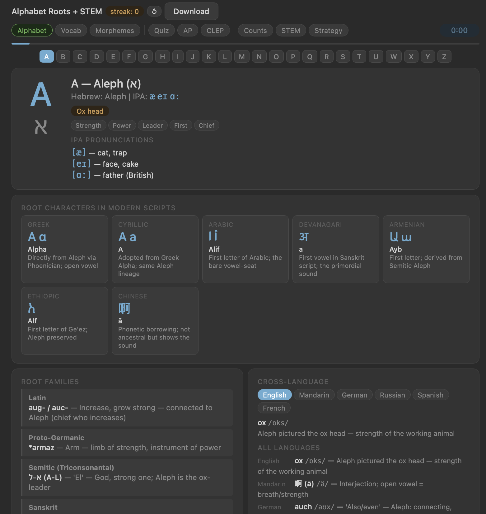
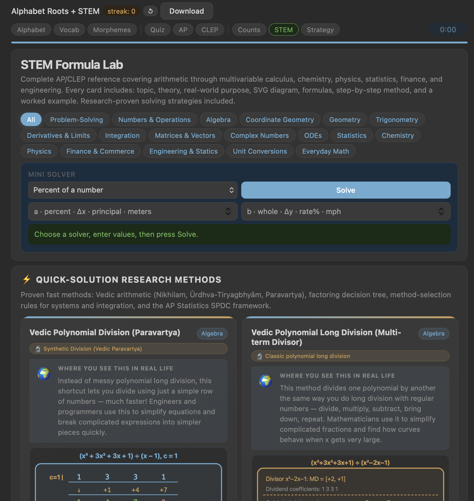
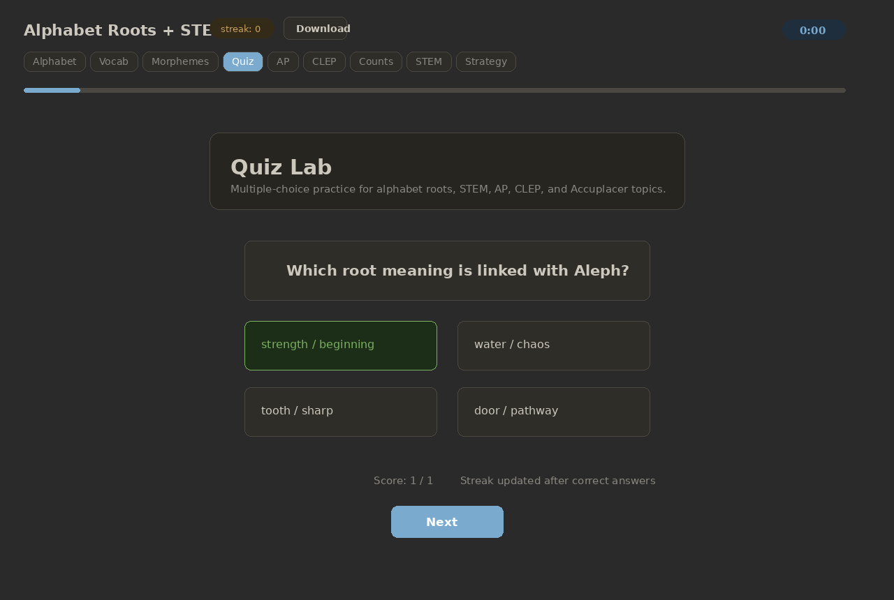

# LinguaSTEM App

A single-file HTML study app for exploring alphabet roots, vocabulary, morphemes, STEM formulas, strategy lessons, and quiz/exam practice.

## App Screenshots

### Alphabet mode



### STEM Formula Lab



### Quiz Lab



## Main Study Modes

- **Alphabet** — Hebrew-root inspired alphabet cards with IPA pronunciation, root meanings, modern script connections, and cross-language vocabulary.
- **Vocab** — interactive vocabulary reveal cards.
- **Morphemes** — searchable morpheme bank with filters.
- **Counts** — overview of morpheme categories and totals.
- **STEM** — formula cards, diagrams, worked examples, quick methods, and solvers.
- **Strategy** — reading and writing strategy lessons.
- **Quiz / AP / CLEP** — generated practice questions for alphabet, morphemes, arithmetic, algebra, geometry, calculus, physics, chemistry, AP, CLEP, and Accuplacer-style topics.

## App Highlights

- Self-contained HTML app — no build step or server required.
- Responsive dark UI with compact navigation.
- Streak counter, timer, progress bar, and previous/next navigation.
- Multiple study modes from language roots to STEM problem-solving.
- Built-in download button for saving the app locally.

## Representative Snippets

### Mode navigation

```html
<button class="mode-btn active" onclick="setMode('explore')">Alphabet</button>
<button class="mode-btn" onclick="setMode('vocab')">Vocab</button>
<button class="mode-btn" onclick="setMode('morph')">Morphemes</button>
<button class="mode-btn" onclick="openQuizLab()">Quiz</button>
<button class="mode-btn" onclick="openExamLab('ap')">AP</button>
<button class="mode-btn" onclick="openExamLab('clep')">CLEP</button>
<button class="mode-btn" onclick="setMode('stem')">STEM</button>
<button class="mode-btn" onclick="setMode('strategy')">Strategy</button>
```

### STEM formula card styling

```css
.formula-card{
  background:linear-gradient(160deg,var(--c2) 0%,var(--c1) 100%);
  border:.5px solid var(--bd);
  border-radius:14px;
  overflow:hidden;
  display:flex;
  flex-direction:column;
}
```

## File Structure

```text
stem-language-app(3).html
├── <style> app theme, layout, cards, quiz, STEM, strategy UI
├── DATA alphabet roots and vocabulary
├── MORPHEMES searchable morpheme entries
├── QUICK_STEM_METHODS formula and quick-method cards
├── quiz generators for multiple subjects
└── render functions for each mode
```

## Run Locally

Open the HTML file directly in a browser:

```bash
open "stem-language-app(3).html"
```

Or serve it locally:

```bash
python3 -m http.server 8000
```

Then visit:

```text
http://localhost:8000/stem-language-app(3).html
```
